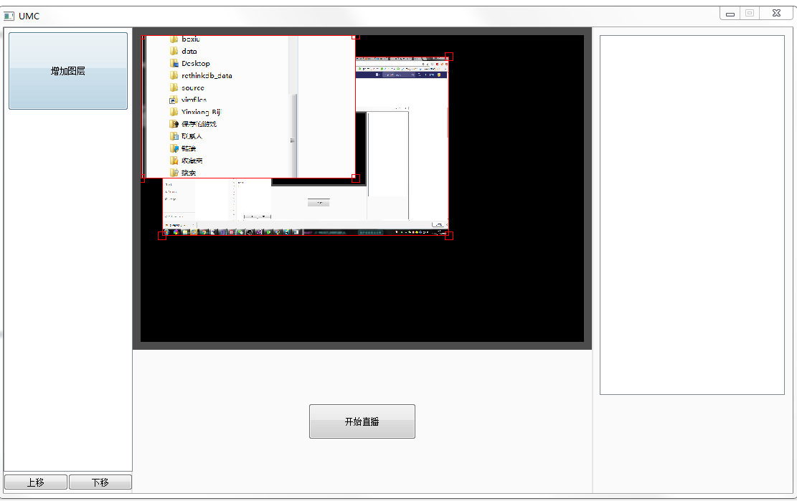

# UMC 
  主要用于替OBS工具,只是想想而已,还没写完。。。
  
### 1. 开发环境搭建
     vs 2017 
     qt 5.7.*
     sdl 2.0.*
     ffmpeg 

### 2.当前主要任务
    视频合成的问题已经解决， 还差音频的测试， 视频流推流在wetool 工具里面已经测试了， ok 。
    但是推流的时候要去创建一个推流缓存，额， 这个问题要解决一下。天知道会发生什么.方正我一个写的话， 慢慢拉
    
### 3. 弹幕集成的问题
    现在去处理视频就很卡了， 嗯，得想个办法优化一下处理流程。。, 弹幕还好说，之前在直播君上就处理了， so easy
    
### 4.软件截图
